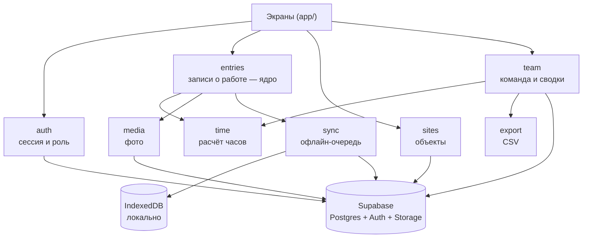
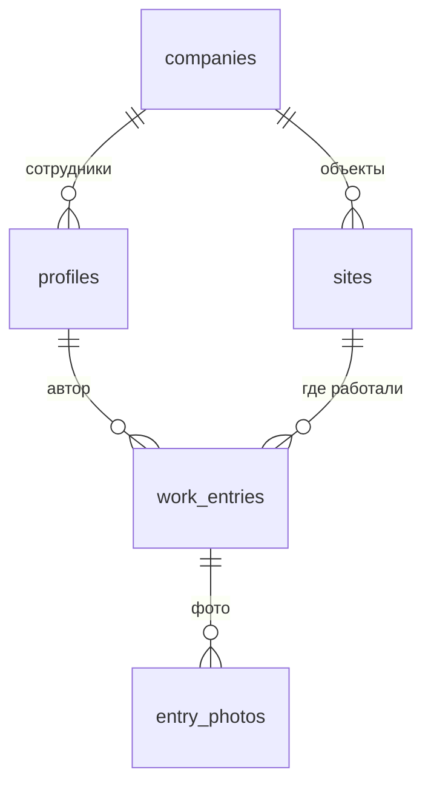

# K group — архитектура

**Дата:** 2026-09-07
**Статус:** на согласовании
**Автор:** архитектурная проработка перед фазой бэкенда

---

## 1. Что строим

Мобильное веб-приложение (PWA) для строительной фирмы. Рабочий на объекте отмечает,
**сколько и над чем он работал**, прикладывает фото. Шеф видит сводку по всей команде
и выгружает отчёты.

Одной фразой: **табель рабочего времени с фотоотчётами, в телефоне**.

Это не «CRM» в классическом смысле — нет клиентов, сделок, воронки. Это **учёт труда**.
Слово «CRM» дальше не используем, чтобы оно не притащило за собой лишние сущности.

### Кто пользуется

| Роль | Кто | Что делает |
|---|---|---|
| `worker` | рабочий на объекте | отмечает часы, пишет отчёты, видит только своё |
| `boss` | шеф / прораб | видит всех, управляет объектами и людьми, выгружает данные |

Масштаб: десятки человек. Одна компания. Проектируем под это, без запаса на нагрузку,
которой не будет.

### Главный сценарий (ради него всё)

> Рабочий приходит на объект → «Почати роботу». Вечером → «Завершити роботу».
> Часы записаны, даже если он больше ничего не сделает.
> Позже открывает эту запись → дописывает, что делал → добавляет 3 фото → готово.
> Работает, даже когда на объекте нет сети.

Ключевое: **часы фиксируются всегда, отчёт добавляется по желанию**. Часы — это
заработок, их нельзя ставить в зависимость от того, есть ли у человека силы писать
текст в конце смены.

---

## 2. Что уже сложилось в коде (as-is)

Честная картина, прежде чем что-то менять.

- Next.js 16 (App Router, Turbopack), TypeScript strict, Tailwind **v4** (конфиг в CSS
  через `@theme`, файла `tailwind.config.ts` нет и быть не должно), shadcn/ui, `date-fns/uk`.
- **Бэкенда нет вообще.** Все данные — статические моки в `src/lib/mock/`. Состояние
  живёт в React и сбрасывается при перезагрузке.
- Тема тёмно-**серая** (`--bg: #0A0A0C`) + жёлтый `#FFC93C`. Светлой темы нет.
- Навигация: Головна / Об'єкти / **+** / Години / Звіти.
- Все тексты — украинские, через словарь `src/lib/i18n/uk.ts`. Ни одной строки в JSX.
- Mobile-only: `PhoneFrame` отдаёт контент во всю ширину на телефоне и центрирует
  колонку 430px на десктопе.

Архитектура, сложившаяся стихийно: **плоский слой презентации без домена**. Компоненты
сами лезут в моки. Нормально для прототипа и ровно то место, куда вставляется домен.

### Что меняем, а что нет

| Что | Решение |
|---|---|
| **Навигация** (5 табов) | **не трогаем** — остаётся Головна / Об'єкти / + / Години / Звіти |
| Тема | перекрашиваем в тёмно-зелёную по макету |
| Welcome-экран | добавляем, сейчас его нет вообще |
| «Години» | **улучшаем**, не ломаем: таймер остаётся, добавляется персистентность |
| «Звіти» | **перепроектируем целиком** — это ядро продукта |
| «Об'єкти», «Головна» | остаются, подключаются к данным |

---

## 3. Границы модулей

Режем по смыслу задачи, а не по типу файла.



Стрелки идут в одну сторону: экраны → домен → хранилище. Колец нет.

### За что отвечает каждый модуль

| Модуль | Отвечает за | Не знает про |
|---|---|---|
| `auth` | текущий пользователь, его роль, вход/выход | записи, объекты |
| `entries` | создание, чтение, правка записей о работе; старт и стоп смены | как они попадают в сеть |
| `time` | арифметика: отработано / перерыв / сверхурочно, суммы за период | базу, UI |
| `media` | сжатие фото, загрузка в Storage, подписанные ссылки | форму записи |
| `sync` | очередь несинхронизированного, повторы, идемпотентность | смысл того, что синхронизирует |
| `sites` | справочник объектов | записи |
| `team` | список людей, суммы часов за период | как запись создавалась |
| `export` | превращение выборки в CSV | UI |

`time` — чистые функции без побочных эффектов. Покрываем тестами первым, потому что
ошибка в расчёте часов = ошибка в зарплате.

### Швы — где систему будут резать

Три места, через которые пойдут интерфейсы. Больше абстрагировать не надо.

1. **`sync` между `entries` и Supabase.** Модуль записей не вызывает базу напрямую,
   а кладёт задание в очередь. Единственный способ дать офлайн, не размазав его по коду.
2. **`media`.** Сегодня Supabase Storage, завтра может быть S3 или Cloudflare Images
   (когда фото станет много и трафик подорожает). Один файл на замену.
3. **`export`.** Сегодня CSV, завтра попросят Excel и PDF. Формат отделён от выборки.

Интерфейс появляется, когда есть вторая реализация, а не «на будущее».

---

## 4. Модель данных

Подробности с SQL — в [DATA-MODEL.md](DATA-MODEL.md). Здесь суть.



**Одна сущность `work_entries` вместо двух.** Время в ней обязательно, описание и
фото — нет. «Години» и «Звіти» — два взгляда на одни и те же строки:

- «Години» показывает их как часы, сгруппированные по периодам;
- «Звіти» показывает их как отчёты, где важны описание и фото;
- запись без описания помечается «Без опису» и её можно дополнить.

Так часы и отчёты не могут разойтись. Если бы это были две таблицы, рабочий отметил бы
8 часов, написал отчёт на 6 — и шеф не знал бы, какой цифре верить.
См. [ADR-0002](decisions/0002-odna-zapis-vremya-obyazatelno.md).

| Сущность | Источник правды | Меняется |
|---|---|---|
| `companies` | Postgres | почти никогда |
| `profiles` | Postgres (id = `auth.users.id`) | редко |
| `sites` | Postgres | редко |
| `work_entries` | Postgres, черновик — IndexedDB | постоянно |
| `entry_photos` | файл в Storage, метаданные в Postgres | вместе с записью |

**`work_entries` — единственное, что нельзя потерять.** Это заработок людей.

### Персональные данные

В базе: имя, email, часы работы, фото объектов. Персональные данные, но не
чувствительная категория. Требования: доступ строго по роли (RLS), фото в приватном
бакете со временными ссылками, бэкапы на стороне Supabase. Пофайлового шифрования
не делаем — здесь оно не окупается.

### Транзакции

- **Нужна:** запись и её фото должны появиться вместе. Решается порядком: сначала фото
  в Storage, потом одна вставка со ссылками. Если вставка не прошла — в Storage остаётся
  мусор, который вычищает ночная задача. Дешевле распределённой транзакции.
- **Переживём рассинхрон:** суммы часов на экране команды. Отстали на минуту — не беда.

---

## 5. Стек

Всё, что уже есть, остаётся. Добавляем минимум.

| Что | Чем | Почему именно так |
|---|---|---|
| Фреймворк | **Next.js 16**, App Router | уже в проекте |
| Хостинг | **Vercel** | решено; ноль настройки под Next |
| База, auth, файлы | **Supabase** | решено; Postgres скучен и проверен, RLS закрывает права на уровне базы |
| Клиент Supabase | `@supabase/supabase-js` + `@supabase/ssr` | официальный путь для App Router |
| Локальное хранилище | **Dexie** (обёртка IndexedDB) | очередь синхронизации и черновики; `localStorage` не тянет фото |
| Service Worker | **Serwist** | Next 16 сам рекомендует его для офлайн-кэша, есть пример под Turbopack |
| Индикатор сети | `useOffline` из `next/offline` | встроено в Next 16, флаг `experimental.useOffline` |
| Стили | Tailwind v4 + shadcn/ui | уже в проекте |
| Иконки, даты, шрифт | `lucide-react`, `date-fns/uk`, Manrope | уже в проекте |

**Чего сознательно НЕ берём:**

- Redux / Zustand / TanStack Query — данных мало, `sync` и так держит своё состояние.
  Вторая система управления состоянием рядом с очередью = гарантированный рассинхрон.
- Prisma / Drizzle — `supabase gen types` уже даёт типы. ORM поверх RLS обычно кончается
  тем, что RLS обходят.
- SEO, публичные страницы, SSG — приложение целиком за логином, оптимизировать нечего.
- Отдельная роль над шефом — ролей ровно две.

**Чем платим:** привязкой к Supabase (RLS-политики не переносятся в другую базу дословно)
и к Vercel. Для команды из одного-двух разработчиков это правильный размен: меньше кода,
который придётся чинить в 2 часа ночи.

---

## 6. Как рендерим

SEO не нужно → можно было бы делать чистое клиентское SPA. Но офлайн диктует правила.

**Решение:** гибрид, граница проходит по офлайн-доступности.

| Что | Как рендерим | Почему |
|---|---|---|
| Welcome, вход | Server Component | статика, отдаётся мгновенно |
| Защита маршрутов | **`proxy.ts`** (в Next 16 `middleware.ts` переименован) | обновление сессии Supabase, редирект неавторизованных |
| Все экраны за логином | Client Components + чтение через `sync` | должны открываться офлайн из локального кэша |
| Экспорт, тяжёлые сводки | Route Handler на сервере | не тащить всю базу в телефон |

Сервер отвечает за **вход и права**, клиент — за **данные и офлайн**.
Подробнее — [ADR-0004](decisions/0004-klientskiy-render-radi-oflayna.md).

---

## 7. Дерево папок

Навигация сохраняется, поэтому маршруты почти не меняются — добавляются welcome,
вход и вложенные экраны.

```
src/
├── app/
│   ├── (marketing)/
│   │   └── page.tsx              # welcome «Робота. Просто. Чітко.» — единственный публичный экран
│   ├── (auth)/
│   │   ├── login/page.tsx
│   │   └── callback/route.ts
│   ├── (app)/                    # всё за логином, навигация как сейчас
│   │   ├── layout.tsx            # PhoneFrame + BottomNav + FAB + офлайн-баннер
│   │   ├── page.tsx              # Головна
│   │   ├── objects/
│   │   │   ├── page.tsx          # Об'єкти
│   │   │   └── [id]/page.tsx     # объект: часы, люди, отчёты по нему
│   │   ├── hours/page.tsx        # Години — таймер и периоды
│   │   ├── reports/
│   │   │   ├── page.tsx          # Звіти: вкладки «Мої» / «Команда» (вторая — только boss)
│   │   │   ├── new/page.tsx      # новая запись вручную
│   │   │   └── [id]/page.tsx     # просмотр и правка, дозаполнение описания и фото
│   │   ├── time/manual/page.tsx  # остаётся как есть (вход из «Години»)
│   │   └── more/page.tsx         # профиль, выход, управление людьми для шефа
│   ├── api/
│   │   └── export/route.ts       # CSV
│   ├── manifest.ts               # PWA-манифест
│   ├── layout.tsx
│   └── globals.css               # зелёные токены
├── modules/                      # домен — по смыслу, не по типу файла
│   ├── auth/  entries/  sites/  team/  time/  media/  export/  sync/
├── components/                   # презентация, без знания о базе
│   ├── layout/  shared/  home/  hours/  reports/  objects/  team/  ui/
└── lib/
    ├── supabase/                 # client.ts, server.ts, types.gen.ts
    ├── i18n/                     # uk.ts — по-прежнему единственный источник текстов
    └── format.ts
supabase/
├── migrations/                   # SQL, по файлу на изменение
└── seed.sql
docs/
├── ARCHITECTURE.md  DATA-MODEL.md  DESIGN-SYSTEM.md  REPORTS.md  PWA.md  ROADMAP.md
└── decisions/                    # ADR
src/proxy.ts                      # защита маршрутов (бывший middleware.ts);
                                  # лежит рядом с app/, а не в корне репозитория —
                                  # в корне Next его просто не видит
```

Ключевое отличие от текущей структуры — появился `src/modules/`. Компоненты перестают
ходить в моки напрямую и начинают спрашивать домен.

---

## 8. Риски

Три места, где вероятнее всего заболит. Называю сам, до того как случилось.

1. **Офлайн-синхронизация — самая дорогая часть проекта.**
   Классические грабли: рабочий нажал «Зберегти» дважды, сеть вернулась, в базе две
   записи. Лечим `client_id` (uuid с телефона) + `upsert on conflict` — вставка
   идемпотентна. Второй риск: фото по 4 МБ забивают IndexedDB и мобильный трафик;
   лечим сжатием до ~1600px WebP **до** записи в очередь. Сюда придётся возвращаться.

2. **RLS легко написать так, что рабочий видит чужие часы.**
   Ошибка тихая: ничего не падает, просто утекают данные. Поэтому политики пишем один
   раз в миграции, а не правим руками в дашборде, и проверяем каждую роль по чек-листу
   перед первым релизом.

3. **iOS PWA — не полноценная платформа.**
   Push только с iOS 16.4+ и только для установленного приложения, `beforeinstallprompt`
   в Safari нет (инструкцию показываем текстом), Safari чистит IndexedDB после ~7 дней
   без визитов. Последнее опасно для очереди: несинхронизированная запись может пропасть.
   Поэтому очередь не должна жить в телефоне долго — синхронизируем при первой сети и
   показываем явный статус «не відправлено».

---

## 9. План этапов

Каждый этап заканчивается работающим приложением. Подробности — [ROADMAP.md](ROADMAP.md).

| Этап | Что появляется | Готово, когда |
|---|---|---|
| 1 | Зелёная тема + welcome-экран, навигация как была, на моках | макет и приложение совпадают на 390px |
| 2 | Supabase: схема, RLS, вход по email/паролю | рабочий заходит и видит своё имя из базы |
| 3 | **Главный сценарий:** таймер и ручной ввод пишут в базу | часы, отмеченные на телефоне, видны шефу |
| 4 | «Звіти» целиком: лента, детальная, дозаполнение, фото | отчёт с фото создаётся и открывается |
| 5 | Офлайн: очередь, статусы, повторы | в авиарежиме запись сохраняется и уходит при сети |
| 6 | Вкладка «Команда» + експорт CSV | шеф выгружает месяц по всем |
| 7 | PWA-полировка: иконки, установка, push | ставится на Android и iOS |

Порядок неслучаен: этап 3 — самый рискованный и самый ценный, поэтому он третий,
а не последний. Офлайн (этап 5) идёт после того, как онлайн-путь доказал, что работает.
