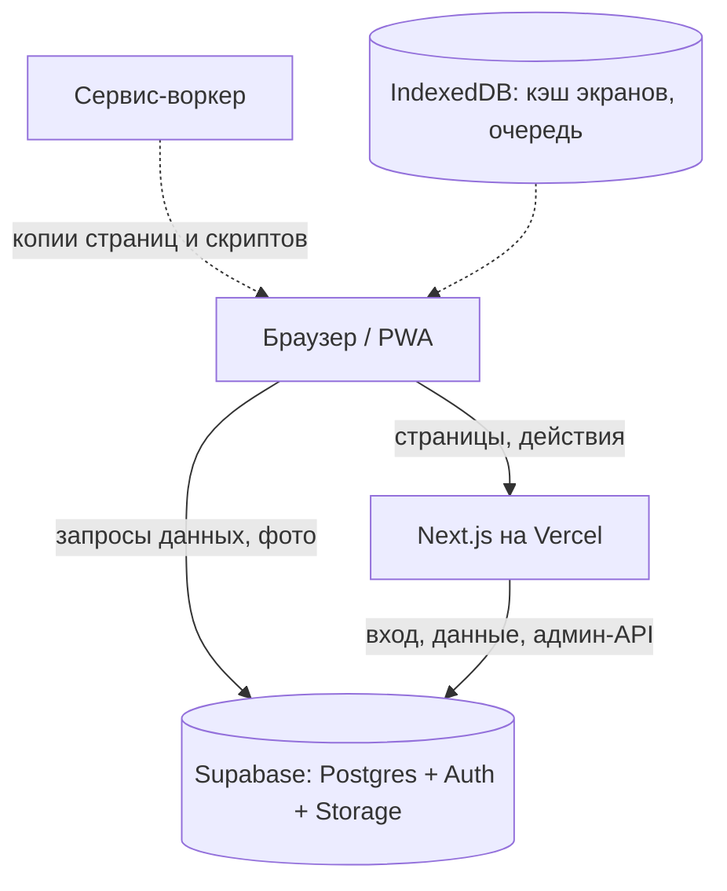

# Архитектура

**Состояние:** октябрь 2026, по коду (не план). Почему принимались решения — в [decisions/](decisions/).

## 1. Что это

Мобильное веб-приложение (PWA) для строительной или кровельной фирмы: **учёт труда**, а не CRM. Рабочий вносит часы, пишет отчёты с фото, отмечает дорогу на объект. Шеф видит всех, считает зарплату, выгружает данные. Масштаб — десятки человек в одной фирме; несколько фирм изолированы друг от друга по `company_id`.

| Роль | Видит | Может |
|---|---|---|
| `worker` | только своё | вносить время и отчёты, создавать объекты, менять язык и своё фото |
| `boss` | всё по фирме | всё то же + команда, настройки фирмы, категории работ, дашборд, архив и удаление объектов, расчёт и выгрузки по всем |

Главный сценарий: **добавить время (даже без сети) → при желании написать отчёт с фото, проблемным местом и дорогой → шеф собирает табель и считает зарплату.**

## 2. Принципы

1. **Права — в базе, а не в интерфейсе.** Каждая таблица закрыта Row Level Security; кнопка «для шефа» — удобство, а не защита.
2. **Часы — отдельно от отчёта.** Отчёт может быть без времени, время — без отчёта. Дорога — третья, отдельная запись, в часы не входит.
3. **Один словарь на язык.** Ни одной строки текста в JSX; три словаря с общей формой (ошибка компиляции, если ключ пропущен).
4. **Быстро и без сети.** Данные экранов запоминаются на телефоне, добавление времени работает офлайн.
5. **Дизайн — только токены.** Цвета и размеры из `tokens.css`, компоненты из `components/ui` (см. [DESIGN-SYSTEM.md](DESIGN-SYSTEM.md)).

## 3. Слои

```mermaid
graph TD
    Browser[Браузер / PWA] -->|страницы, действия| Next[Next.js на Vercel]
    Browser -->|запросы данных, фото| Supabase
    Next -->|вход, данные, админ-API| Supabase[(Supabase: Postgres + Auth + Storage)]
    SW[Сервис-воркер] -.->|копии страниц и скриптов| Browser
    IDB[(IndexedDB: кэш экранов, очередь)] -.-> Browser
```

- **Сервер Next.js** проверяет вход (`proxy.ts`), отдаёт страницы, выполняет серверные действия (создание отчётов, запись времени, заведение сотрудников) и выгрузки (`/api/export`).
- **Браузер** сам читает данные месяца для экранов «Години», дашборда, «Команда» (так экраны быстро переключают период и работают на сохранённых данных) — права при этом держит RLS.
- **Админ-ключ** (`SUPABASE_SERVICE_ROLE_KEY`) используется в одном месте — заведение сотрудников (`modules/team/actions.ts`), и только после проверки, что вызывающий — шеф.

## 4. Вход и защита маршрутов

`src/proxy.ts` (в Next 16 вместо `middleware`) на каждом запросе:

1. проверяет подпись токена **локально** (`auth.getClaims()`), без обращения к Supabase; при сбое один раз спрашивает сервер (`getUser()`) — вошедшего не выбросит из-за сбоя проверки;
2. обновляет протухший токен и пишет свежие куки в ответ;
3. невошедшего ведёт на `/welcome`, вошедшего со `/welcome` и `/login` — на главную;
4. кладёт проверенный id в заголовок `x-user-id` — `getProfile()` берёт его, не ходя за токеном второй раз.

Публичные пути: `/welcome`, `/login`, `/forgot-password`, `/reset-password`, `/auth/*`. Восстановление пароля: `forgot-password` → письмо Supabase → `/auth/callback` (обмен кода на сессию) → `/reset-password`.

Это быстрая проверка, а не авторизация: данные закрывает RLS.

## 5. Модули (`src/modules/`)

| Модуль | Отвечает за |
|---|---|
| `auth` | сессия, профиль, вход/выход, восстановление и смена пароля, имя |
| `entries` | записи рабочего времени: запросы, создание, правка, удаление; состояние карточки |
| `time` | чистая арифметика времени: переход через полночь, перерыв, норма, допустимая длительность (1 мин – 18 ч) |
| `reports` | отчёты: создание (с временем и дорогой), правка, категории, «проблемное место», смена объекта, фото, подписи категорий и их перевод |
| `travel` | дорога на объект: запросы, удаление, разбор километров |
| `sites` | объекты: запросы, создание, правка, архив, удаление, фото |
| `team` | сотрудники: список, заведение, деактивация, дневная норма |
| `company` | настройки фирмы: норма, категории работ |
| `dashboard` | агрегаты для дашборда шефа (месяц, квартал, год) |
| `payroll` | текст расчёта зарплаты на языке интерфейса |
| `export` | CSV, Excel, PDF, CSV отчётов; общие колонки |
| `media` | сжатие фото на телефоне, загрузка, подписанные ссылки |

Модуль не знает про интерфейс; компонент не знает про устройство базы. Логика с вычислениями покрыта тестами (`*.test.ts` рядом с кодом).

## 6. Данные экранов

- **Страница (сервер)** отдаёт первый кадр: профиль, список объектов, главная.
- **Экран (клиент)** дальше сам читает данные из Supabase и сначала показывает сохранённую копию (`lib/offline/cache.ts`), потом свежие данные. Копии лежат в памяти вкладки и в IndexedDB, ключ всегда начинается с id пользователя, при выходе всё стирается (`OfflineReset` на `/welcome` и `/login`), срок жизни — 14 дней.
- **После записи** (новое время, отчёт) копии сбрасываются, чтобы не показать устаревшее.
- **Загрузка с сервера** на каждом запросе: вход (локально) → профиль → данные страницы; тяжёлые части (календарь) подгружаются отдельным куском.

## 7. Языки

`src/lib/i18n/`: `uk.ts` (эталон формы), `en.ts`, `nl.ts` — типизированные словари. Язык — в куке `locale` (на год, на устройстве), корневой layout читает её и кладёт словарь в контекст (`I18nProvider`). Сервер: `await getT()`; клиент: `useT()`. Даты и числа форматируются по языку (`lib/format.ts`), множественное число — `pluralize`. Стандартные категории работ переводятся таблицей `categoryNames` (в базе они лежат по-украински, это ключ); свои категории шефа показываются как введены. Тексты расчёта и выгрузок тоже на языке интерфейса.

## 8. Офлайн

См. [PWA.md](PWA.md): сервис-воркер (`public/sw.js`) хранит страницы и скрипты; запись времени без сети попадает в очередь IndexedDB (`lib/offline/outbox.ts`) и уходит напрямую в базу с ключом идемпотентности `client_id`; плашки «Немає зв'язку» / «Не відправлено: N».

## 9. Выгрузки

`/api/export` (Node runtime): `kind=hours` — CSV, Excel (две вкладки, итоги формулами, настоящие даты/время), PDF-табель; `kind=reports` — CSV отчётов. Колонки, названия вкладок, дни недели и числа — на языке интерфейса; разделитель CSV зависит от языка (`;` для uk/nl, `,` для en), чтобы Excel не склеивал колонки. Файлы называются `VK-group_…`. Права решает RLS: рабочий получит только свои данные даже по прямой ссылке.

## 10. Безопасность

- RLS на всех таблицах; помощники прав (`current_company_id`, `is_boss`) вынесены в закрытую схему `private`.
- Представление `entry_hours` — `security_invoker`: уважает права вызывающего.
- Фото в закрытых бакетах, ссылки подписанные и временные.
- Сброс пароля одинаково отвечает на любой email (не выдаёт, кто зарегистрирован); обратные адреса после письма проходят через `safeNextPath` (нет открытого редиректа).
- Секретный ключ только на сервере; на клиенте — публичный (anon) ключ.

## 11. Известные ограничения

- Нет самостоятельной регистрации фирм, оплаты и подписок — фирму и первого шефа создаёт `supabase/bootstrap.sql`.
- Офлайн: только добавление времени (новую запись). Правка, фото, создание объектов требуют сети. На iPhone очередь уходит, когда приложение открыто (фоновой отправки нет).
- Нет push-уведомлений, интеграций с бухгалтерскими системами, GPS-отметок.
- Покрытие тестами: логика и выгрузки; сквозных (e2e) тестов интерфейса нет.
- Нет слежения за ошибками в боевой среде и юридических страниц (политика конфиденциальности / DSGVO).
