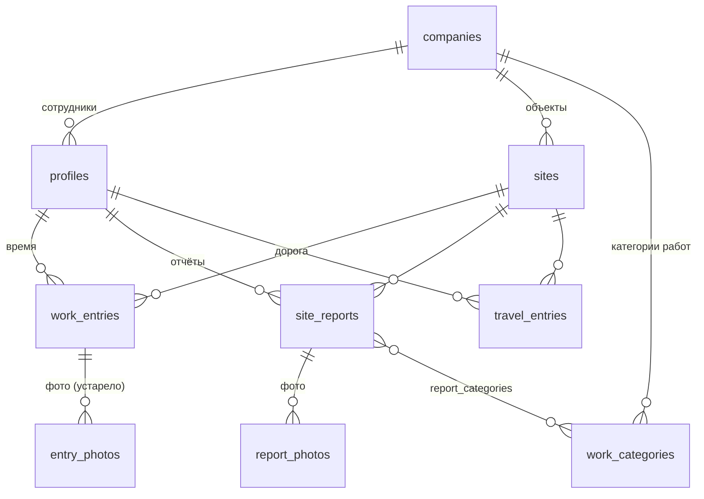

# Модель данных

**Состояние:** по миграциям `0001`–`0019` (`supabase/migrations/`). Источник правды — сами миграции; этот документ их пересказывает. Миграции не правятся — меняются новой.

## Схема

Связи, помеченные `on delete set null` (объект): удаление объекта **не** удаляет время, отчёты и дорогу — у них просто пропадает привязка.

## Таблицы

### `companies`
`id`, `name`, `daily_norm_minutes` (норма по умолчанию, 480), `created_at`.
Фирма одна на установку, но все данные изолированы по `company_id`.

### `profiles` (сотрудники)
`id` (= `auth.users.id`), `company_id`, `full_name`, `role` (`worker` | `boss`), `daily_norm_minutes` (своя норма, 480 по умолчанию), `avatar_hue`, `avatar_path` (фото, `0016`), `is_active` (деактивированный не входит и скрыт из списков), `created_at`.

### `sites` (объекты)
`id`, `company_id`, `name`, `kind` (вид работ — теперь выбирается из категорий фирмы; старые значения вроде «Плоский дах» узнаются и переводятся), `address`, `status` (`not_started` | `in_progress` | `completed` | `paused`), `archived_at`, `photo_path` (обложка), `created_by` (`0014`), `created_at`.
Создавать может любой сотрудник; править — шеф или автор; архивировать и удалять — только шеф.

### `work_entries` (рабочее время — ядро табеля)
`id`, `client_id` (уникальный ключ идемпотентности: запись не задвоится при повторной отправке), `company_id`, `author_id`, `site_id`, `work_date`, `started_at`, `ended_at`, `break_start`, `break_end`, `source` (`manual`; `timer` остался в старых данных), `description`, `created_at`, `updated_at`.
**Вычисляемые базой колонки:** `break_minutes`, `total_minutes` (чистое время смены; переход через полночь учтён).
**Ограничения:** перерыв — обе границы или ни одной (кроме открытой смены); длительность смены 1 мин – 18 ч; у одного человека не более одной открытой смены.
Таймера в приложении нет; записи создаются вручную (`source = manual`).

### `entry_photos`
Фото записи времени (`entry_id`, `storage_path`, размеры, `sort_order`). Осталась от ранней модели, где фото крепились к смене; фото теперь крепятся к отчётам.

### `site_reports` (отчёты)
`id`, `client_id`, `company_id`, `author_id`, `site_id`, `work_date`, `description`, `other_text` («Інше» вписано вручную, `0015`), `problem_note` («Проблемное место» — что забрало время, `0017`), `created_at`, `updated_at`. **Времени в отчёте нет** — оно связано только совпадением автор + дата + объект с записями `work_entries`.

### `report_photos`
До 6 фото отчёта: `report_id`, `storage_path`, `width`, `height`, `size_bytes`, `sort_order`.

### `work_categories` и `report_categories`
Категории работ фирмы (`label`, `sort_order`, `archived_at`, `is_other` — признак «Інше», `0015`) и связь «отчёт ↔ категории». Архивная категория не предлагается в новых отчётах, но в старых остаётся. Стандартные 14 названий лежат по-украински — это ключ для перевода на en/nl.

### `travel_entries` (дорога на объект, `0018`–`0019`)
`id`, `client_id`, `company_id`, `author_id`, `site_id`, `work_date`, `started_at`, `ended_at`, `km` (необязательно, до 9999,9), `created_at`; вычисляемая `minutes`.
**Отдельная таблица:** дорога не входит в часы, табель, расчёт зарплаты и выгрузки часов.

### `entry_hours` (представление)
`work_entries` + имя автора + норма + `worked_minutes` (до нормы) + `overtime_minutes` (сверх нормы) + число фото. `security_invoker`: показывает только то, что разрешено вызывающему. Из него строятся выгрузки.

## Права (RLS)

Включена на всех таблицах. Помощники — `private.current_company_id()` и `private.is_boss()` (закрытая схема, не доступны через API).

| Таблица | Читать | Создавать | Править | Удалять |
|---|---|---|---|---|
| `work_entries`, `travel_entries`, `site_reports` | своё; шеф — всё по фирме | только от своего имени | своё; шеф — любое | своё; шеф — любое |
| `report_photos`, `entry_photos`, `report_categories` | по правам родителя | по правам родителя | — | по правам родителя |
| `sites` | вся фирма | любой сотрудник | шеф или автор | шеф |
| `profiles` | вся фирма | через админ-ключ (шеф заводит) | своё имя и фото; шеф — любого | — (деактивация) |
| `companies` | своя | — | шеф (норма) | — |
| `work_categories` | вся фирма | шеф | шеф | шеф (архив) |

Окон правки по дате нет: свои записи можно править и удалять всегда (решение владельца, `0007`).

## Хранилище файлов

Три закрытых бакета, доступ по папке фирмы `{company_id}/…`, формат `webp`/`jpeg`/`png`, до 5 МБ (аватар до 2 МБ); приложение сжимает фото на телефоне до ~1600 px перед загрузкой.

| Бакет | Что | Создан |
|---|---|---|
| `entry-photos` | фото отчётов | `0001` |
| `site-photos` | обложки объектов | `0006` (+`0010`, `0014`) |
| `avatars` | фото сотрудников | `0016` |

## Журнал миграций

| № | Что |
|---|---|
| 0001 | схема: компании, сотрудники, объекты, время, фото, права, `entry_hours`, бакет `entry-photos` |
| 0002 | помощники прав — в закрытую схему `private` |
| 0003 | разрешён «открытый» перерыв |
| 0004–0005 | права на фото; удаление записей |
| 0006 | удаление объектов, обложка, бакет `site-photos` |
| 0007 | убрано окно правки 7 дней |
| 0008 | отчёты как отдельная сущность: `site_reports`, `report_photos`, `work_categories`, `report_categories` |
| 0009 | перенос старых записей с описанием/фото в отчёты |
| 0010 | исправление чтения `site-photos` |
| 0011, 0013 | экран по умолчанию для шефа (добавлено и убрано) |
| 0012 | шеф правит `companies` (норма) |
| 0014 | любой сотрудник создаёт объекты (`created_by`) |
| 0015 | категории под кровлю, `is_other`, `other_text` |
| 0016 | фото сотрудника (`avatar_path`, бакет `avatars`) |
| 0017 | «проблемное место» отчёта (`problem_note`) |
| 0018 | дорога на объект (`travel_entries`) |
| 0019 | удаление объекта не блокируется записью дороги |

## Принципы

- **Идемпотентность.** У времени, отчётов и дороги есть `client_id`: повторная отправка той же записи (потерялся ответ, очередь после обрыва) не создаёт дубль.
- **Арифметика времени — в базе** (вычисляемые колонки) и дублируется чистыми функциями в `modules/time` для проверки до отправки.
- **Деньги не хранятся.** Ставка зарплаты вводится в калькуляторе и нигде не сохраняется.
